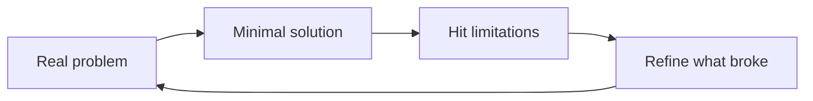
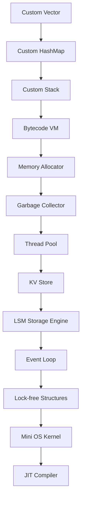
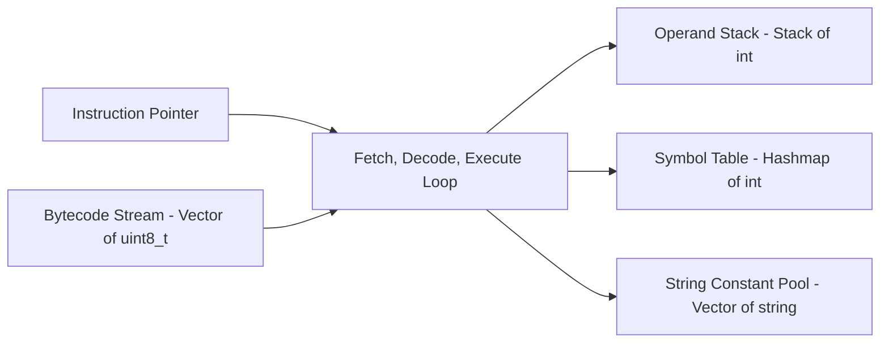

# Systems Programming From First Principles

> "Great engineers don't start by building big things. They start by understanding deeply and solving real problems."
> — inspired by Dennis Ritchie


**Michael Christian Mensah**

---

A from-scratch systems programming curriculum: no `std::vector`, no `std::unordered_map`, no shortcuts. Every data structure is hand-built in C++, then used to construct a bytecode virtual machine. Nothing gets added until a real limitation forces it — the roadmap below grew out of hitting walls, not out of planning ahead.

## Table of Contents

- [Philosophy and Learning Approach](#philosophy-and-learning-approach)
- [Project Roadmap](#project-roadmap)
- [Project 1: Custom Vector](#project-1-custom-vector)
- [Project 2: Custom HashMap](#project-2-custom-hashmap)
- [Project 3: Custom Stack](#project-3-custom-stack)
- [Project 4: Bytecode Virtual Machine](#project-4-bytecode-virtual-machine)
- [Topics Learned](#topics-learned)
- [What Comes Next](#what-comes-next)
- [Books and Resources](#books-and-resources)
- [Repository Structure](#repository-structure)

---

## Philosophy and Learning Approach

Every project here follows the same loop — the same one Ritchie used building C and Unix:



**Rules followed throughout:**

- **Build the minimum.** No feature is added without a forcing problem.
- **Feel the pain first.** Every concept is understood by breaking something, not by reading about it.
- **Mental model over memorization.** The goal is to understand *why* something exists, not *what* it is.
- **Each project feeds the next.** Nothing is built in isolation.
- **Instrumentation over intuition.** Real behavior observed through code beats theoretical reasoning.

**A project is "done" when:**
1. You can explain how it works without looking at the code.
2. The next project's limitations force you to come back and refine it.

---

## Project Roadmap

| Stage | Status |
|---|---|
| Custom Vector — dynamic memory, deep copy, Rule of Three | Done |
| Custom HashMap — hashing, collisions, rehashing, templates | Done |
| Custom Stack — LIFO abstraction on Custom Vector | Done |
| VM Stage 1 — fetch-decode-execute, arithmetic opcodes | Done |
| VM Stage 2 — variables (STORE/LOAD), string constant pool | Done |
| VM Stage 3 — control flow (JMP, JMP_IF_ZERO), loops | Done |
| VM Stage 5 — functions (CALL, RETURN, stack frames) | In progress |
| VM Stage 10 — Assembler (eliminate manual address counting) | Planned |
| Memory Allocator — bump allocator to free list | Planned |
| Garbage Collector — mark and sweep, added to VM | Planned |
| Thread Pool — concurrency foundation | Planned |
| KV Store — HashMap + Allocator + Thread Pool | Planned |
| LSM Storage Engine — KV Store + disk persistence | Planned |
| Event Loop — async I/O | Planned |
| Lock-free Structures — atomics, memory ordering | Planned |
| Mini OS Kernel — everything reunites here | Planned |
| JIT Compiler — VM + OS + Allocator knowledge | Planned |

Each stage builds directly on the ones before it:



---

## Project 1: Custom Vector

**The problem it solves.** Fixed arrays can't grow:

```cpp
int arr[10];   // what if you need 11? you're stuck.
```

**The core idea.**

```
Allocate a heap block with some initial capacity.
When size == capacity → allocate a new block twice as large,
copy all elements, delete the old block.
```

**Implementation**

```cpp
template<typename T>
class Vector {
private:
    T*     data_;
    size_t size_;
    size_t capacity_;

    void resize() {
        size_t newCap = capacity_ == 0 ? 1 : capacity_ * 2;
        T* newData = new T[newCap];
        for (size_t i = 0; i < size_; ++i)
            newData[i] = data_[i];
        delete[] data_;
        data_ = newData;
        capacity_ = newCap;
    }

public:
    Vector() : data_(nullptr), size_(0), capacity_(0) {}

    // Rule of Three — deep copy constructor
    Vector(const Vector<T>& other) : size_(other.size_), capacity_(other.capacity_) {
        data_ = new T[capacity_];
        for (size_t i = 0; i < size_; ++i)
            data_[i] = other.data_[i];
    }

    // Rule of Three — copy assignment operator
    Vector& operator=(const Vector<T>& other) {
        if (this == &other) return *this;
        delete[] data_;
        size_ = other.size_;
        capacity_ = other.capacity_;
        data_ = new T[capacity_];
        for (size_t i = 0; i < size_; ++i)
            data_[i] = other.data_[i];
        return *this;
    }

    // Rule of Three — destructor
    ~Vector() { delete[] data_; }

    void   push_back(T val);
    T      pop_back();
    T&     operator[](int index);
    size_t size();
    size_t capacity();
    void   clear();
    void   inspect();   // instrumentation
};
```

**Concepts learned**

| Concept | How It Was Learned |
|---|---|
| Dynamic memory allocation | `new[]` / `delete[]` for growing arrays |
| Heap vs stack | Array on heap survives function scope |
| Amortized O(1) push | Why `capacity *= 2` and not `+= 1` |
| Shallow copy | Compiler default — copies pointer, not data |
| Double-free | Shallow copy destructor called twice → crash |
| Deep copy | Allocate new block, copy values, own the memory |
| Rule of Three | Destructor + copy constructor + copy assignment |
| Unsigned underflow | `size_t` at 0 minus 1 → wraps to max value |
| Stack overflow guard | `throw out_of_range` on empty pop |
| Template classes | `template<typename T>` — blueprint, not code |

**The pain that forced each feature:** a fixed array that couldn't grow forced `push_back` + `resize`. `size_ - 1` at `size_ == 0` underflowed and crashed, forcing an `out_of_range` guard. Passing a `Vector` by value into `load()` caused a double-free, forcing the Rule of Three. Needing `Vector<uint8_t>` and `Vector<string>` at the same time for the VM forced templates.

---

## Project 2: Custom HashMap

**The problem it solves.** Arrays require integer indexes. What if you want to look up values by name?

```cpp
data[0] = "Michael";      // fine
data["name"] = "Michael"; // impossible with arrays
```

**The core idea.**

```
Convert any key into an integer index using a hash function.
Store the value at that index in a bucket array.
Handle collisions using separate chaining (linked list per bucket).
Rehash when load factor exceeds 0.75.
```

**Implementation**

```cpp
template<typename V>
class Hashmap {
private:
    struct Entry {
        string key;
        V      value;
        Entry* next;
        Entry(string k, V v) : key(k), value(v), next(nullptr) {}
    };

    Entry** buckets;    // heap-allocated bucket array
    int     size_;      // current bucket count
    int     numEntries;

    int hashfunction(string key) {
        int sum = 0;
        for (char c : key) sum += c;
        return sum % size_;
    }

    void rehash() {
        int newSize = size_ * 2;
        Entry** newBuckets = new Entry*[newSize];
        for (int i = 0; i < newSize; i++) newBuckets[i] = nullptr;

        for (int i = 0; i < size_; i++) {
            Entry* current = buckets[i];
            while (current != nullptr) {
                Entry* next = current->next;
                int newIdx = 0;
                for (char c : current->key) newIdx += c;
                newIdx %= newSize;
                current->next = newBuckets[newIdx];
                newBuckets[newIdx] = current;
                current = next;
            }
        }
        delete[] buckets;
        buckets = newBuckets;
        size_ = newSize;
    }

public:
    Hashmap() : size_(10), numEntries(0) {
        buckets = new Entry*[size_];
        for (int i = 0; i < size_; i++) buckets[i] = nullptr;
    }

    void put(string key, V value);
    V    get(string key);
    int  size();
    void inspect();   // instrumentation — shows chain lengths and load factor
};
```

**Concepts learned**

| Concept | How It Was Learned |
|---|---|
| Hash function | ASCII sum → array index |
| Hash collision | "name" and "mane" hash to same index |
| Silent overwrite | Second key destroys first key's value |
| Separate chaining | Linked list per bucket — multiple keys coexist |
| Load factor | `entries / buckets` — measures collision density |
| Rehashing | Double bucket array, reinsert every entry |
| Why reinsertion is mandatory | `% SIZE` changes when SIZE doubles |
| O(1) vs O(n) degradation | Long chains make HashMap a linear search |
| Template parameters | `template<typename V>` — value type becomes flexible |
| Static vs non-static members | `static` methods can't access instance data |
| Compile-time constants | `constexpr` vs `const` for floating-point statics |
| Double pointer `Entry**` | Pointer to heap array that can be replaced |
| Head insertion | O(1) insert vs O(chain length) tail insert |

**The pain that forced each feature:** needing a string index forced the hash function. Two keys landing in the same bucket caused silent data corruption, forcing separate chaining. 50 entries in 10 buckets degraded to O(n) lookup, forcing rehashing. Instrumentation exposing chain lengths set the load-factor threshold. Needing `HashMap<string, int>` for the VM forced the template value parameter.

---

## Project 3: Custom Stack

**The problem it solves.** A Stack doesn't solve a *storage* problem — it solves an *access-pattern* problem. It enforces **Last-In, First-Out (LIFO)** access on top of a Vector, which naturally models function calls, expression evaluation, undo systems, and — critically — VM execution.

**The core idea.**

```
Restrict a Vector to only push and pop at one end.
The most recently pushed value is always the next one accessed.
```

**Implementation**

```cpp
template<typename T>
class Stack {
private:
    Vector<T> data_;   // built on YOUR Vector — not std::vector

public:
    void push(T val)  { data_.push_back(val); }

    T pop() {
        if (isEmpty())
            throw runtime_error("stack underflow");
        return data_.pop_back();
    }

    T& peek()      { return data_[data_.size() - 1]; }
    bool isEmpty()  { return data_.size() == 0; }
    int  size()     { return data_.size(); }
};
```

**Concepts learned**

| Concept | How It Was Learned |
|---|---|
| Abstract Data Type (ADT) | Stack is a behavioral contract, not a storage mechanism |
| LIFO | Last pushed value is first retrieved |
| Stack underflow | `pop()` on empty stack → crash without guard |
| Unsigned underflow | `size_t` wrapping at 0 causes same crash as Vector |
| Variable shadowing | Parameter named `data` hiding member `data_` |
| Name collision bugs | Compiler silently uses wrong variable |

**Why LIFO matters in a VM**

```
PUSH 5       → stack: [5]
PUSH 3       → stack: [5, 3]
ADD          → pop 3, pop 5, push 8
             → stack: [8]
```

The operand stack is the VM's temporary computation space. Every arithmetic instruction, every function call, every return value flows through it.

---

## Project 4: Bytecode Virtual Machine

**The problem it solves.** Machine code and assembly are CPU-specific:

```
x86: mov eax, 5 / add eax, 3   ← only runs on Intel/AMD
ARM: MOV R0, #5 / ADD R0, R0   ← only runs on ARM
```

A VM makes execution portable:

```
Source code → compiler → bytecode (portable)
                              ↓
                         VM (runs anywhere)
                              ↓
                         Real CPU execution
```

**Architecture** — the VM is built entirely on Projects 1–3:



**Current instruction set**

| Opcode | Value | Operand | Description |
|---|---|---|---|
| `PUSH` | 0 | 1 byte (value) | Push literal value onto operand stack |
| `ADD` | 1 | none | Pop two values, push sum |
| `PRINT` | 2 | none | Pop top value, print it |
| `MUL` | 3 | none | Pop two values, push product |
| `DIV` | 4 | none | Pop two values, push quotient |
| `SUB` | 5 | none | Pop two values, push difference |
| `STORE` | 6 | 1 byte (pool index) | Pop value, store in variable |
| `LOAD` | 7 | 1 byte (pool index) | Push variable value onto stack |
| `HALT` | 8 | none | Stop execution |
| `JMP` | 9 | 1 byte (address) | Unconditional jump |
| `JMP_IF_ZERO` | 10 | 1 byte (address) | Pop value, jump if zero |

**Fetch-decode-execute loop**

```cpp
void execution() {
    while (true) {
        uint8_t instruction = byteStream[ip_++];  // FETCH

        switch (instruction) {                     // DECODE + EXECUTE
            case PUSH: {
                int val = byteStream[ip_++];
                stack.push(val);
                break;
            }
            case ADD: {
                int b = stack.pop();
                int a = stack.pop();
                stack.push(a + b);
                break;
            }
            // ... other cases
            case HALT: return;
        }
    }
}
```

**String constant pool.** Variable names can't fit in a single byte, so strings are stored separately and referenced by index:

```cpp
// setup
uint8_t xIdx = vm.addString("x");   // index 0
uint8_t yIdx = vm.addString("y");   // index 1

// bytecode
STORE, xIdx    // pop → variables_["x"]
LOAD,  xIdx    // push variables_["x"]
```

**Example programs**

Program 1 — Arithmetic with variables:

```cpp
// x = 75, y = 35, z = x * y, print z → prints 2625
program.push_back(VM::PUSH);   program.push_back(75);
program.push_back(VM::STORE);  program.push_back(xIdx);
program.push_back(VM::PUSH);   program.push_back(35);
program.push_back(VM::STORE);  program.push_back(yIdx);
program.push_back(VM::LOAD);   program.push_back(yIdx);
program.push_back(VM::LOAD);   program.push_back(xIdx);
program.push_back(VM::MUL);
program.push_back(VM::STORE);  program.push_back(zIdx);
program.push_back(VM::LOAD);   program.push_back(zIdx);
program.push_back(VM::PRINT);
program.push_back(VM::HALT);
```

Program 2 — Countdown loop (5 to 1):

```
// Equivalent high-level code:
// x = 5
// while x != 0:
//     print x
//     x = x - 1

[0]  PUSH       5          // x = 5
[2]  STORE      xIdx
[4]  LOAD       xIdx       // ← loop start (address 4)
[6]  PRINT
[7]  LOAD       xIdx
[9]  PUSH       1
[11] SUB
[12] STORE      xIdx
[14] LOAD       xIdx
[16] JMP_IF_ZERO  20       // if x == 0 → exit
[18] JMP          4        // jump back to loop start
[20] HALT
```

Program 3 — Multiplication via repeated addition:

```
// 6 * 4 without MUL opcode → 24
// result = 0, counter = 4
// while counter != 0:
//     result = result + 6
//     counter = counter - 1
// print result

[0]  PUSH       0          // result = 0
[2]  STORE      resultIdx
[4]  PUSH       4          // counter = 4
[6]  STORE      counterIdx
[8]  LOAD       counterIdx // ← loop start
[10] JMP_IF_ZERO  28
[12] LOAD       resultIdx
[14] PUSH       6
[16] ADD
[17] STORE      resultIdx
[19] LOAD       counterIdx
[21] PUSH       1
[23] SUB
[24] STORE      counterIdx
[26] JMP          8
[28] LOAD       resultIdx
[30] PRINT
[31] HALT
```

**Concepts learned building the VM**

| Concept | How It Was Learned |
|---|---|
| Bytecode | Portable binary instruction encoding |
| Instruction pointer (ip_) | Integer cursor into bytecode stream |
| Operand stack | Temporary computation space — your Stack project |
| Fetch-decode-execute cycle | The core VM loop — `while(true)` + `switch` |
| Opcode encoding | Enums are just integers — `PUSH = 0` |
| Instruction operands | Next byte(s) after opcode carry data |
| Symbol table | `HashMap<string, int>` stores named variables |
| String constant pool | Strings stored separately, referenced by index |
| JMP mechanics | `ip_ = addr` — overwrite instruction pointer |
| JMP_IF_ZERO | Conditional branching — foundation of all control flow |
| Manual address counting | Pain of writing raw bytecode by hand |
| Infinite loops | Unconditional JMP backward with no exit condition |
| Fall-through bug | Missing `break` in switch → next case executes |
| Missing operand byte | Off-by-one in bytecode → entire program shifts |
| Two operand stacks | Call stack (OS) vs operand stack (VM) — different things |

**The pain that forced each feature:** being able to compute but not remember forced STORE/LOAD + the HashMap. Hardcoding `"x"`, `"y"`, `"z"` in the pool forced a public `addString()`. Raw byte addresses breaking on every edit is the pain that will force the future Assembler (Stage 10). An infinite loop with no exit condition forced `JMP_IF_ZERO`.

---

## Topics Learned

**Memory Management**

- **Stack vs Heap** — local variables die with scope, heap lives until `delete`
- **`new[]` / `delete[]`** — heap allocation and deallocation
- **Memory ownership** — who is responsible for freeing allocated memory
- **Dangling pointer** — pointer to freed memory — silent corruption
- **Double-free** — calling `delete` twice on same address — undefined behavior
- **Memory leak** — allocated memory never freed — RAM climbs over time
- **Shallow copy** — copies pointer, shares ownership — always breaks with destructor
- **Deep copy** — allocates new block, copies values — correct ownership
- **Rule of Three** — if you define a destructor, define copy constructor and copy assignment too
- **Unsigned underflow** — `size_t` at zero minus one wraps to maximum value

**Data Structures**

- **Dynamic array** — amortized O(1) push via capacity doubling
- **Separate chaining** — linked list per hash bucket for collision resolution
- **Load factor** — `entries / buckets` — controls rehash threshold
- **Rehashing** — double bucket array and reinsert all entries
- **LIFO stack** — Last-In-First-Out access pattern
- **Stack underflow** — pop on empty stack — requires guard

**Computer Architecture**

- **ASCII encoding** — characters are integers (`'a' = 97`)
- **Instruction Set Architecture (ISA)** — contract between software and CPU
- **Instruction pointer / program counter** — tracks current execution position
- **Fetch-decode-execute cycle** — the fundamental CPU loop
- **Operand stack** — how stack machines evaluate expressions
- **Call stack vs operand stack** — two completely different stacks with different purposes
- **Bytecode** — portable intermediate binary representation
- **Virtual Machine** — software that executes bytecode on any real CPU

**C++ Language**

- **Templates** — blueprints for generating type-specific classes at compile time
- **Template instantiation** — compiler generates real class from template when used
- **`constexpr`** — compile-time constant evaluation
- **`static` member functions** — belong to class, not instance, no `this` pointer
- **Variable shadowing** — parameter or local variable hides member with same name
- **Enum values** — named integer constants, start at 0 by default
- **Switch fall-through** — missing `break` executes next case
- **`pragma once`** — include guard preventing double inclusion
- **Header files** — templates must be fully defined in headers
- **Relative include paths** — `../../folder/file.h` navigation
- **`-I` compiler flag** — adds directory to include search path

**Software Engineering**

- **Evolutionary design** — build minimum, feel limitation, refine what broke
- **Mental model** — understanding *why* something exists, not just *what* it is
- **Instrumentation** — adding diagnostic output to observe real system behavior
- **Abstract Data Type (ADT)** — behavioral contract, not storage mechanism
- **Amortized complexity** — occasional expensive operation averaged over many cheap ones
- **Constant pool** — store strings separately, reference by index in bytecode
- **Premature generalization** — adding features before a forcing problem exists

---

## What Comes Next

### VM Stage 5 — Functions (CALL / RETURN)

The biggest conceptual leap so far. Requires:

```
CALL addr     — save return address, jump to function
RETURN        — jump back to caller

Stack frames:
    each function call gets its own:
        → return address
        → local variables
        → saved registers
```

This is exactly what CS:APP Chapter 3.7 describes. The JVM call stack, CPython frame objects, and every function call in every language reduce to this mechanism.

**What it forces:** a second stack (call stack) separate from the operand stack, or a frame pointer mechanism that divides the single stack into regions.

### VM Stage 10 — Assembler

The pain already being felt — manual address counting — gets worse with every instruction added. The Assembler eliminates it:

```asm
    PUSH 5
    STORE counter
loop:
    LOAD counter
    JMP_IF_ZERO done
    LOAD counter
    PRINT
    PUSH 1
    SUB
    STORE counter
    JMP loop
done:
    HALT
```

Labels replace addresses. The Assembler resolves `loop` and `done` to real byte positions automatically.

### Memory Allocator

```
Bump allocator    — move a pointer forward, no individual frees
Free list         — linked list of free blocks, malloc/free simulation
Buddy allocator   — power-of-two block splitting, used in Linux kernel
```

When the VM's heap (Stage 7) needs dynamic allocation, a custom allocator replaces `new`/`delete`.

### Garbage Collector

Mark-and-sweep GC added to the VM:

```
Mark phase   — trace all reachable objects from roots
Sweep phase  — free all heap objects not marked as reachable
```

This is why Java, Python, and Go don't require manual `free()` calls.

---

## Books and Resources

| Book | When to Read | Chapters |
|---|---|---|
| **CS:APP** — Bryant & O'Hallaron | Now | Ch 3.1–3.4 (machine code), Ch 3.7 (procedures — before VM Stage 5), Ch 9.9 (allocators — before Memory Allocator) |
| **Crafting Interpreters** — Nystrom (free) | Alongside VM | Part III — Chapters 14–24 |
| **The C Programming Language** — K&R | Alongside projects | Read cover to cover — study how Ritchie thought |
| **OSTEP** (free online) | Before OS Kernel | All of it — OS from first principles |
| **Programming Massively Parallel Processors** | After Thread Pool | GPU computing foundation |

---

## Repository Structure

**Environment**

```
OS:       Fedora Linux (primary), Windows (secondary)
Compiler: GCC with -std=c++17
Debugger: GDB
Editor:   VS Code
```

**Layout**

```
CPP/
├── CustomVector/
│   └── CustomVector.h
├── CustomHashMap/
│   └── CustomHashMap.h
├── CustomStack/
│   └── CustomStack.h
└── VM/
    └── src/
        └── VM.cpp
```

**Compile command**

```bash
g++ VM.cpp -o vm -I"path/to/CPP/" -std=c++17 -mconsole
```

---

*Every feature in this repository was forced by a real limitation hit during implementation — not added speculatively. Documentation updated as each stage is completed.*
